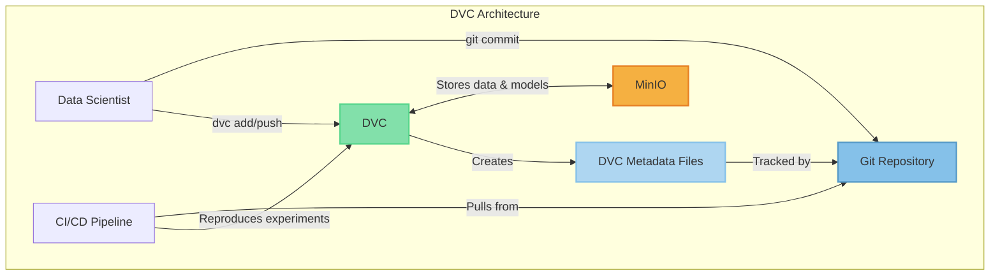

# DVC Architecture

DVC (Data Version Control) provides a lightweight, Git-integrated approach to ML experiment tracking and data versioning.

## Component Descriptions

1. **Git Repository**: Tracks code and DVC metadata files
2. **DVC CLI Tool**: Manages data versioning and ML pipelines
3. **MinIO Object Storage**: Stores large files like datasets and models
4. **DVC Metadata Files**: Small files that reference data in remote storage

## Key Features

- Git-integrated workflow
- Versioning for data and models
- Pipeline definition and execution
- Reproducible experiments
- Integration with CI/CD systems
- Offline capability
- **Native Python Packaging Compatibility**: DVC works seamlessly with standard Python packaging approaches (requirements.txt, setup.py, pyproject.toml, etc.) without imposing its own packaging system

## Packaging Approach

DVC respects and integrates with Python's native packaging ecosystem:

- Uses standard `requirements.txt` or other dependency management files
- No proprietary packaging format for models or code
- Dependencies are managed through standard Python tools (pip, conda, poetry, etc.)
- Model versioning is handled through Git and DVC without affecting how Python packages are structured
- Enables straightforward integration with existing Python projects and deployment pipelines