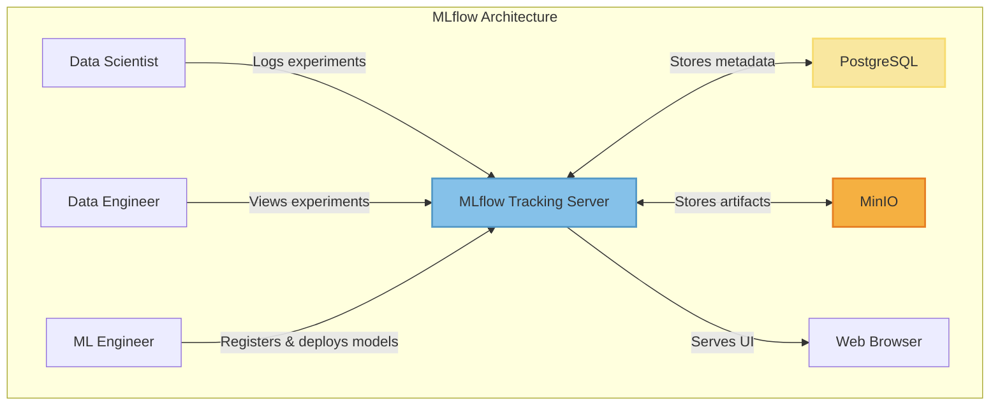

# MLflow Architecture

MLflow provides a comprehensive experiment tracking and model registry solution with a server-based architecture.

## Component Descriptions

1. **MLflow Tracking Server**: Central server that receives experiment logs, serves the UI, and manages the model registry
2. **PostgreSQL Database**: Stores experiment metadata, parameters, metrics, and model registry information
3. **MinIO Object Storage**: Stores experiment artifacts like models, datasets, and other large files
4. **Web UI**: Provides visualization and comparison of experiments and models

## Key Features

- Centralized experiment tracking
- Model registry for versioning and staging
- Artifact storage
- Parameter and metric logging
- UI for experiment comparison
- **Custom Model Packaging**: MLflow uses its own packaging format and conventions

## Packaging Approach

MLflow implements a custom packaging system that diverges from standard Python packaging practices:

- Uses its own `MLmodel` format for model metadata
- Creates custom model packaging formats (MLflow Models)
- Imposes specific structure for saving and loading models
- Handles dependencies through custom model flavor configurations
- May require adaptations when integrating with existing Python projects or deployment pipelines
- Can lead to additional complexity when working with projects that follow standard Python packaging conventions